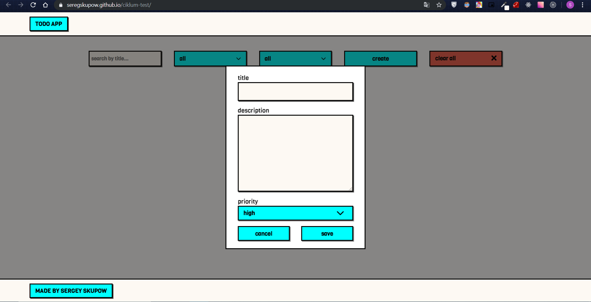

#TODO APP

A simple TODO app made with pure JavaScript(ES6)

* Empty state

* Create/Edit state

* Common state

* Filtered state

---

#USAGE

###To manage the notes you should use these controlls:###

* **create** button:

-calls modal window 

where user has to write the title,description and set the priority status of the note. 
After this, user can save the note by clicking **save** button

or cancel creating note by clicking **cancel** button

---
* **clear all** button:

deletes all notes and clears the `LocalStorage`.
---

###Find/filter notes

*use **search field** to find the note by the **title**

*use **filter selects** to search notes by **priority status** or **complete status**

---

###Note controls:###

You can access note controlls by hovering **menu** element

After this, you would see three parameters appeared:

* **delete** - deletes the note.
* **edit*** - calls the modal window where you can edit and save the note.
* **done** - gives the note **done** status:

The **done** note has two buttons:
* **return** - changes note status back to active

* **delete** - deletes the note

---

#BUILT WITH
* pure **JavaScript(ES6)** matching airbnb style guides
* CSS preprocesson **SCSS**
* **Webpack** module bundler

